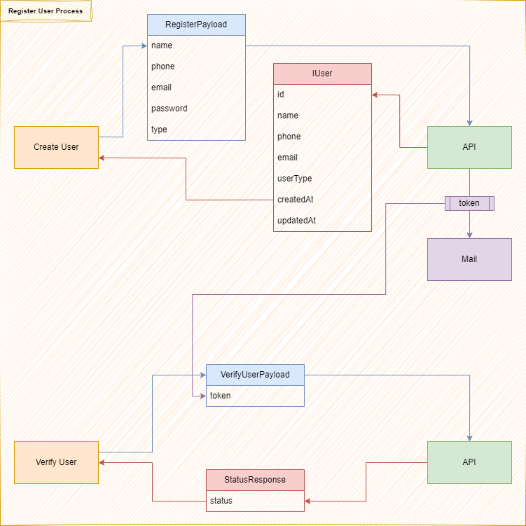
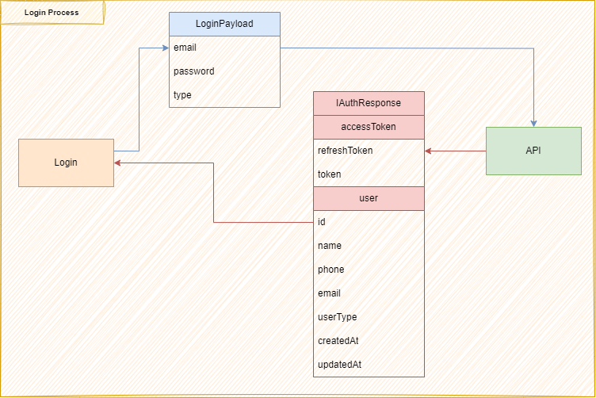
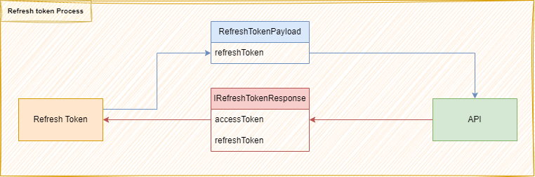
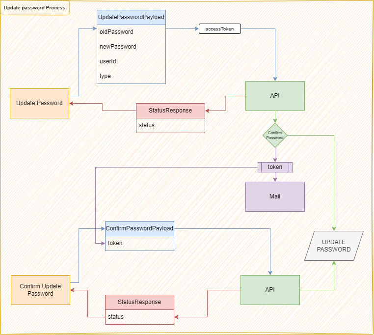
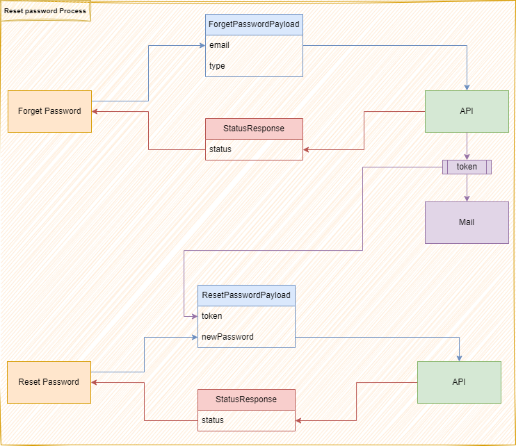

# DocTime API

NodeJS / ExpressJS API with full tested Auth system using JWT

## Testing

The API uses different DB for testing. And after the test is done, The DB is truncated.
To run the Jest tests:

```bash
npm run test
```

*Note*
**Insure the environment variable for test db is set**

## Run the API

The API uses nodemon to run the typescript app in dev mode. Run the 'dev' script to run on your local machine (The port is set in `.env` file).

```bash
npm run dev
```

## Build

```bash
npm run build
```

## Lint and Prettier

Linter:

```bash
npm run lint
```

Prettier:

```bash
npm run format
```

## Mailing

Throughout the auth process, we send emails to Verify User Email, reset password and other business processes. I used for this demo [MailTrap](https://mailtrap.io) as test mail provider, NodeMailer to send email and Nodemailer-mock to test the email sending and reading them.
*Details will be in the article*

## Architecture and process

### Register Process



### Login Process



### Refresh Token Process



### Update password Process



### Reset password Process


